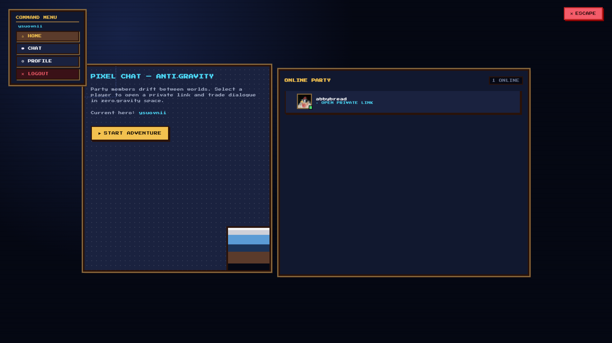
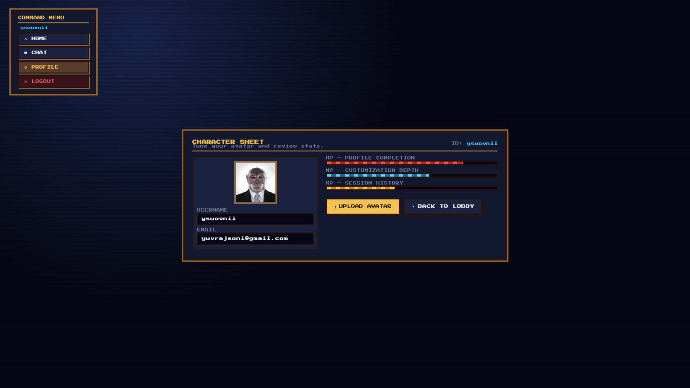

# Pixel-Chat 💬🎮

A **real-time chat application** with a retro **16-bit JRPG pixel art** aesthetic, built with Node.js, Express, Socket.IO, and MongoDB.



---

## ✨ Features

- ⚡ **Real-time Messaging** — Instant communication powered by Socket.IO
- 🎨 **Retro Pixel Art UI** — 16-bit JRPG-inspired design with floating animations
- 🔐 **Authentication** — Secure login/signup with JWT and bcrypt
- 👤 **Profile Settings** — Upload profile pictures via Cloudinary
- 🟢 **Online Status** — See who's online in real-time
- ✍️ **Typing Indicators** — Know when someone is typing
- 📧 **Email Integration** — Nodemailer support for account-related emails
- 🖥️ **Server-Side Rendering** — Fast, dynamic pages with EJS templates

---

## 📸 Preview

### 🔑 Login Page


### 📝 Signup Page


### 🏠 Home Page


### 💬 Chat Page


### ⚙️ Profile Settings


---

## 🛠️ Tech Stack

| Layer        | Technology                              |
|--------------|----------------------------------------|
| **Backend**  | Node.js, Express.js                    |
| **Frontend** | EJS, HTML, CSS, JavaScript             |
| **Database** | MongoDB (Mongoose ODM)                 |
| **Realtime** | Socket.IO                              |
| **Auth**     | JSON Web Tokens (JWT), bcrypt          |
| **Storage**  | Cloudinary (profile picture uploads)   |
| **Email**    | Nodemailer                             |

---

## 📁 Project Structure

```
Pixel-Chat/
├── controller/     # Business logic and app functionalities
├── lib/            # Utility functions and library configurations (DB, mail, Cloudinary)
├── middleware/     # Custom middlewares (authentication, error handling)
├── models/         # Mongoose database schemas and models
├── preview/        # App preview screenshots
├── public/         # Static assets (CSS, images)
├── routes/         # Express routes mapping URLs to controllers
├── views/          # EJS templates for the frontend UI
├── .gitignore      # Ignored files for Git
├── index.js        # Main application entry point (Express + Socket.IO server)
└── package.json    # Project metadata and dependencies
```

---

## 🚀 Getting Started

### Prerequisites

- **Node.js** (v18+)
- **MongoDB** (local or Atlas)
- **Cloudinary** account (for image uploads)

### Installation

```bash
# Clone the repository
git clone https://github.com/ysuovnii/Pixel-Chat.git
cd Pixel-Chat

# Install dependencies
npm install

# Create a .env file with the following variables
# PORT=3000
# MONGO_URI=your_mongodb_connection_string
# JWT_KEY=your_jwt_secret
# CLOUDINARY_CLOUD_NAME=your_cloud_name
# CLOUDINARY_CLOUD_API_KEY=your_api_key
# CLOUDINARY_CLOUD_API_SECRET=your_api_secret

# Start the development server
npm run dev
```

The app will be available at `http://localhost:3000`

---

## 🤝 Contributing

Contributions are welcome! If you'd like to improve Pixel-Chat:

1. Fork the Project
2. Create your Feature Branch (`git checkout -b feature/AmazingFeature`)
3. Commit your Changes (`git commit -m 'Add some AmazingFeature'`)
4. Push to the Branch (`git push origin feature/AmazingFeature`)
5. Open a Pull Request

---

## 📄 License

This project is licensed under the ISC License.
